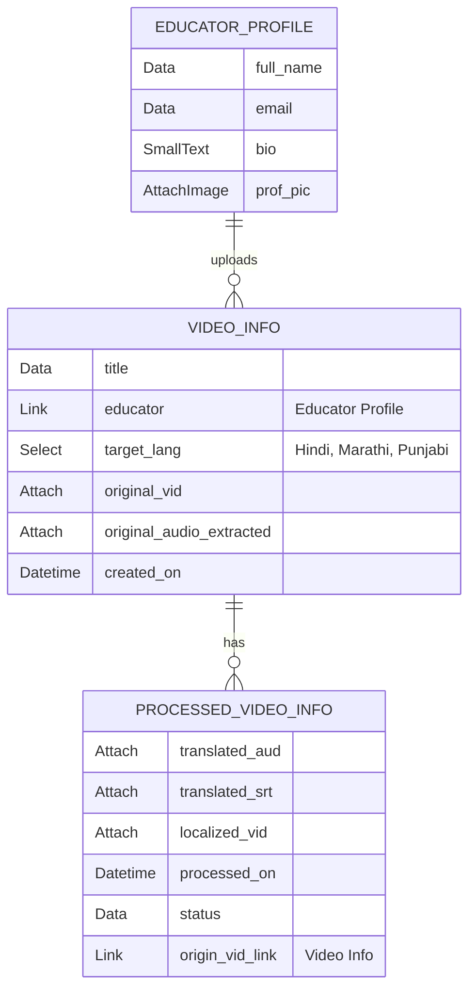

## Video Localizer - Translator

A automated video localizer/translator for native Indian languages.

### Installation

You can install this app using the [bench](https://github.com/frappe/bench) CLI:

```bash
cd $PATH_TO_YOUR_BENCH
bench get-app git@github.com:theapprenticeproject/Video_Translation.git --branch main
bench install-app my_app
```

#### Optional Dependency (Video Preview app)
This frappe app provides a better preview for video uploads upon saving a record for a doctype, improving user exprience.
```
bench get-app git@github.com:Z4nzu/frappe-preview-attachment.git
bench --site your-site-name install-app preview_attachment
```
#### Python Depedency Management (using `uv`)
Install `uv` : (official site : https://docs.astral.sh/uv/getting-started/installation/)
```
curl -LsSf https://astral.sh/uv/install.sh | sh
```
Install Dependencies: 
```
uv pip install -r pyproject.toml
```
### Important Tools/Libraries Used
* FFMPEG
* Bhashini API Services ( STS, Lang Detection )
* Groq STT ( Whisper )


### Doctype Design
The database schema contains this application's Doctypes: Video Info, Processed Video Info, & Educator Profile. The diagram below highlights the definitions and relationships for the doctypes afformentioned. 


### Contributing

This app uses `pre-commit` for code formatting and linting. Please [install pre-commit](https://pre-commit.com/#installation) and enable it for this repository:

```bash
cd apps/my_app
pre-commit install
```

Pre-commit is configured to use the following tools for checking and formatting your code:

- ruff
- eslint
- prettier
- pyupgrade

### License

mit
