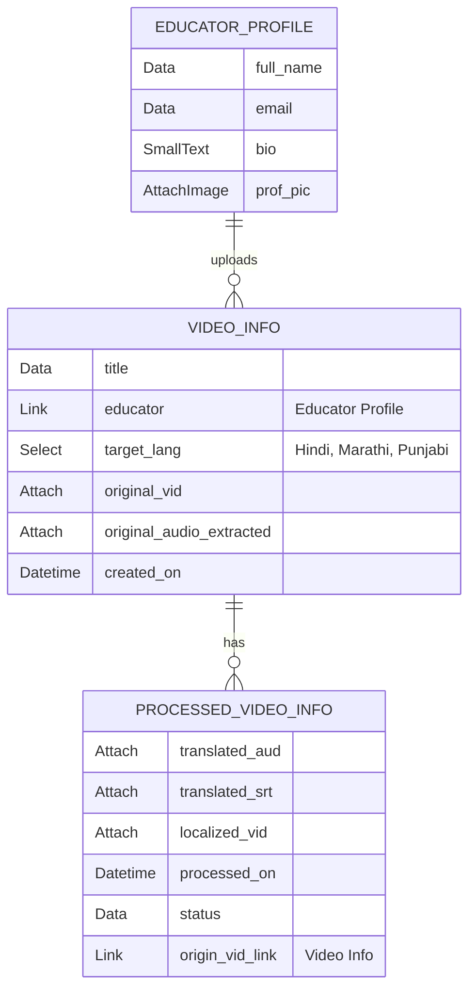

## Video Localizer - Translator

A automated video localizer/translator for native Indian languages.

### Installation

You can install this app using the [bench](https://github.com/frappe/bench) CLI:

```bash
cd $PATH_TO_YOUR_BENCH
bench get-app git@github.com:theapprenticeproject/Video_Translation.git --branch main
bench install-app my_app
```

#### Optional Dependency (Video Preview app)
This frappe app provides a better preview for video uploads upon saving a record for a doctype, improving user exprience.
```
bench get-app git@github.com:Z4nzu/frappe-preview-attachment.git
bench --site your-site-name install-app preview_attachment
```
#### Python Depedency Management (using `uv`)
Install `uv` : (official site : https://docs.astral.sh/uv/getting-started/installation/)
```
curl -LsSf https://astral.sh/uv/install.sh | sh
```
Install Dependencies: 
```
uv pip install -r pyproject.toml
```
### Important Tools/Libraries Used
* FFMPEG
* Bhashini API Services ( STS, Lang Detection )
* Groq ( STT - Whisper )
* Elevenlabs ( Dubbing API )


### Doctype Design
The database schema contains this application's Doctypes: Video Info, Processed Video Info, & Educator Profile. The diagram below highlights the definitions and relationships for the doctypes afformentioned. 

### Doctype Dataflow ( UX )
The diagram illustrates dataflow for a video localization system that utilises background queues to handle a series of sequential functions/tasks. An overview of the steps are highlighted below:
1. A user uploads a video with the details, which creates a **Video Info** record. This uploaded video is saved into the local filesystem under `public/` directory of `original/` (created manually).
2. Once user initiates the process (by clicking "Start Process" button), a chain of background jobs begin. These jobs are managed by **Frappe Queues** system which allows multiple videos to be processed concurrently. Multiple queues are used each dedicated to a specific function:
    * Audio extraction function processes original video file and extracts audio file, thus placing this audio file into another queue for next step.
    * Language detection function processes audio output from previous step (audio extraction function) and detects spoken language. 
    * Subsequent API functions are called and executed in respective queues like subtitle generation, dubbing, etc.
This queuing system ensures each function is executed only after preceding function is completed.
3. As each function in queue completes, it creates and updates a record in **Processed Video Info** doctype. This new record is updated with status with the queuing process allowing us to micro-manage it. The processed Video files along with translated audio files (if any) are stored under `public/` directory of `processed/` (created beforehand).


### Current Custom API Flow
The diagram showcases API flow which are versioned as v1 and v2 and details it as respectively below:  
* **v1 - Non-Hindi Translations :** This flow is designed for multi-step translations often Indic languages other than hindi. Its a pipeline of API calls and local processing stages.
    * Detecting Source language is the common step among both API version which begins with Bhashini language detection API. Audio Extracted using FFMPEG & the output audio file is passed onto next step.
    * Bhashini Speech to Speech (STS) API is a core pipelined translation service which takes audio file and ouputting a new Translated audio file.
    * Muxing of the translated audio is done by overwriting(using FFMPEG) the original audio thus creating a new Translated video file with translated audio track.
    * The final step using FFMPEG is to merge the generated subtitle file with the newly created translated video file.

* **v2 - Hindi Translations :** This flow involves specialized processes for translating to Hindi for a better integrated dubbing experience and can be represented as:
    * **Path I (ElevenLabs)**:
        * The workflow takes the detected language(optional) along with video file and uses the ElevenLabs Dubbing API which handles dubbing. The API outputs a Dubbed Video thus avoiding muxing multiple times.
    * **Path II (Sievedata) :** (option)
        * This represents highly configurable, alternative service. This is intended for more requirements as it can also handle lip sync such services in addition to direct dubbing.

* **Common Processes**
    * When subtitles are needed (end of Video Processing Pipeline), FFMPEG is used to extract the audio track from the original video. This extracted audio is passed to a Speech-to-Text (STT) Groq service to generate a subtitle file (SRT/VTT).


### Contributing

Follow the steps given over the top of this README file to run this app locally.

This app uses `pre-commit` for code formatting and linting. Please [install pre-commit](https://pre-commit.com/#installation) and enable it for this repository:

```bash
cd apps/my_app
pre-commit install
```

Pre-commit is configured to use the following tools for checking and formatting your code:

- ruff
- eslint
- prettier
- pyupgrade

### License

mit
