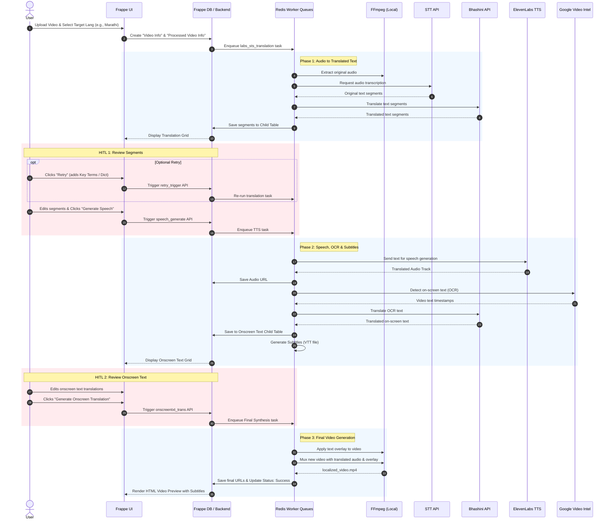

<div align="center">
  <!-- Replace src with your actual repo logo/banner path -->
  <!--  -->

  <h1>Video Localizer - Translator</h1>

  <p>
    An automated video localization and translation pipeline for Indic languages, built to extract, translate, and synthesize video files.
  </p>

  <p>
    <!-- Badges -->
    <a href="https://github.com/frappe/frappe">
      
    </a>
    <a href="https://www.python.org/">
      
    </a>
    <a href="https://mariadb.org/">
      
    </a>
    <!-- <a href="https://github.com/theapprenticeproject/Video_Translation/blob/main/LICENSE">
      
    </a> -->
  </p>

  <p>
    <a href="https://theapprenticeproject.gitbook.io/ai-video-localization/RbOX32eTbHDcOMXmXgoF/"><strong>Old Documentation »</strong></a>
</div>

<hr />

## Table of Contents
**1. [Product Overview](#1-product-overview)<br>
2. [Technical Architecture](#2-technical-architecture)<br>
3. [Cost Structure](#3-cost-structure)<br>
4. [Installation and Deployment](#4-installation-and-deployment)<br>
5. [Access & Credentials](#5-access--credentials)<br>
6. [Data Flow Info](#data-flow-info)<br>
7. [Roadmap & Future Work](#7-roadmap--future-work)<br>**

---

## 1. Product Overview

### 1.1 Purpose
* This tool helps to translate educational videos into multiple native Indian languages. Primarily, educational videos are made in English, this makes sure it localizes every part of video to make it accessible for students of diverse language groups.
* The primary usecase is localization of video in a sequence of steps. The target audience are Educators who can localize their educational content into Indic languages, which then could be served to students.

### 1.2 Key Features
* Localizes video content into multiple Indic languages asynchronously.
* Supports options for both local file & google drive link uploads.
* Automated extraction and translation of on-screen text.
* Generates localized subtitles and translates audio tracks.
* Human-In-The-Philosophy (HITL) to monitor progress steps throughout the entire localization pipeline.
* Versioned REST APIs for pipeline extension and integration.

### 1.3 Known Limitations
* Supports video files with `.mp4` format. 
* Currently suppports only 3 languages - Hindi, Marathi, Punjabi.
* Need for manual review within pipeline if translation not appropriate. 

---

## 2. Technical Architecture

### 2.1 System Architecture
#### 2.1.1 API & Media Transformation Flow

#### 2.1.2 Queue Processing Flow

### 2.2 Tech Stack
* **Frappe** is a low-code web framework which handles server, client-side, database and other configurations altogether.
* Frontend: Javascript (custom client scripts)
* Backend: Python
* Database: MariaDB (MySQL)
* AI Model Providers: Bhashini & ElevenLabs
* Infrastructure: Google Cloud Platform (GCP)
### 2.3 Hosting environment and deployement setup
* **Cloud Environment:**
  * Machine Type: e2-highcpu-8 (8 vCPUs, 8 GB memory)
* Gunicorn runs the Frappe application, nginx receives web traffic. Supervisor is for starting gunicorn processes like workers, scheduler.
* This pipeline uses frappe background job queues, thus the workers config is defined in `common_site_config.json`. Background workers can be increased to pick up more jobs lined up in the queues. During setup, values are set automatically, but can be changes can be made as necessary.
  ```json
    {
      "background_workers": "2",
      "default_site": "[your_site_name]",
      "developer_mode": true,
      "file_watcher_port": 6787,
      "frappe_user": "[your_user_name]",
      "gunicorn_workers": "[2 x CPU_Cores + 1]",
      "live_reload": true,
      "rebase_on_pull": false,
      "redis_cache": "redis://127.0.0.1:13000",
      "redis_queue": "redis://127.0.0.1:11000",
      "redis_socketio": "redis://127.0.0.1:13000",
      "restart_supervisor_on_update": false,
      "restart_systemd_on_update": false,
      "serve_default_site": true,
      "shallow_clone": true,
      "socketio_port": 9000,
      "use_redis_auth": false,
      "webserver_port": 8000
    }
  ```

### 2.4 Third-party Integrations and Dependencies
* **External Dependencies:**
  * FFMPEG
  * Bhashini
  * ElevenLabs
  * Gdown 
  * Google Cloud Video Intelligence
  * Groq (Optional)

---
## 3. Cost Structure
  * More info regarding **ElevenLabs** requests & usage analytics, etc can be found at [API Activity](https://elevenlabs.io/app/api).
  * Current ElevenLabs utilisation is Pro plan, and a reference cost analaysis can be found here [Comparative Cost Analysis](https://ringed-mouse-89f.notion.site/Possible-Costs-Per-Services-227d272657fe802c974de366b5948641?source=copy_link) amongst others. <br>
  <u>Note</u>: Do refer the [elevenlabs api pricing](https://elevenlabs.io/pricing/api) as it could differ based on subscription model or pay-as-you-go model.  
  * Google Video Intelligence's usage can be monitored under Google Cloud Console -> APIs & Services -> Dashboard. The billing would be visible under Google Cloud Console -> Billing and then can be filtered as per project and SKU. 
## 4. Installation and Deployment

### 4.1 Bench Installation
  * Ensure you have a standard Bench [Frappe Installation Guide](https://docs.frappe.io/framework/user/en/installation) environment installed as this project uses Frappe 15.
  * Note on python dependency managament: If you're on an externally managed environment, follow the instructions in the above Frappe docs but substitute uv over pip/venv.
  * Once bench is ready:
    ```bash
    bench init [directory-name]
    ```
  * Create a new site for this project locally:
    ```bash
      cd $PATH_TO_YOUR_BENCH
      bench new-site [your-site-name]
      bench use [your-site-name]
    ```

### 4.2 Installation
#### 4.2.1 App Installation
Now go to the bench directory ( if not already ), and install/clone the frappe video translation app:
```bash
cd $PATH_TO_YOUR_BENCH
bench get-app [github-repo-url-or-ssh] --branch main
bench --site [your-site-name] install-app my_app
```
**Note: Run the folowing command from Bench directory to manually create `/original` and `/processed` folders under site's public directory**: <br>
```bash
cd $PATH_TO_YOUR_BENCH
mkdir sites/[your_site_name]/files/public/{original,processed} 
```
(replace `your_site_name` with your appropriate site name created)

#### 4.2.2 Video Preview App (Optional)
This frappe app provides a better preview for video uploads upon saving a record for a doctype, improving user experience. 
```bash
bench get-app git@github.com:Z4nzu/frappe-preview-attachment.git
bench --site your-site-name install-app preview_attachment
```
Reference: [Frappe Video Preview github](https://github.com/Z4nzu/frappe-preview-attachment)

### 4.3 Dependencies Setup
#### 4.3.1 Python Dependency Management
Install **`uv`** if it's the choice. (Official site: [`uv` Installation Reference](https://docs.astral.sh/uv/getting-started/installation/))
```bash
curl -LsSf https://astral.sh/uv/install.sh | sh
```
#### 4.3.2 Installing Dependencies
This is valid for both local development & deployement server.
* Activate virtual environment if not already:
  ```bash
  source env/bin/activate
  ```
* Go back to the Bench directory & run the following so that dependencies within `pyproject.toml` are installed (editable mode) in central bench frappe environment:
  ```bash
  cd $PATH_TO_YOUR_BENCH
  uv pip install -e apps/my_app
  ```
* While developing if there is a need to add a new dependency to the project, follow:
  * Navigate to `apps/my_app` & run:
    ```bash
    uv add <dependency-name> --no-sync 
    ```
  * Return to the *bench* directory & run the following to install updated dependencies into bench environment:
    ```bash
    cd $PATH_TO_YOUR_BENCH
    uv pip install -e apps/my_app
    ```
    (Alternatively, you can run `bench pip install -e apps/my_app`)

#### 4.3.3 Core Tools/Libraries Setup
* **FFMPEG**:
  * Used for audio/video processing ( e.g., extracting audio from uploaded video, onscreen text overlay, audio-video muxing ).
  * Installation Reference: [FFMPEG Official Docs](https://ffmpeg.org/download.html)

* **Bhashini**:
  * GOI's language translation platform for Indian languages ( STS, ASR, Language Detection, etc. ).
  * Required credentials are userId, ulcaApiKey, email id.
  * Setup Guide: [Bhashini Postman Docs](https://dibd-bhashini.gitbook.io/bhashini-apis)

* **Elevenlabs**:
  * Provides high-quality voice dubbing, multilingual TTS & other services.
  * Docs: [ElevenLabs API](https://elevenlabs.io/docs/overview/intro)

* **Google Video Intelligence API**:
  * An API service from google cloud, used for automatically recognizing metadata within video allowing for extraction. ( e.g., OCR, label detection, etc)
  * Docs: [Video Intellligence API](https://docs.cloud.google.com/video-intelligence/docs)

* **Gdown**:
  * Used for downloading public files links from Google drive.
  * Docs: [Gdown](https://github.com/wkentaro/gdown#gdown) 

### 4.4 Running Application (Local Development)
Once the app and dependencies are installed, you need to configure your environment and start the Frappe processes.<br>
1. **Configure API Keys:** Ensure your `site_config.json` is updated with the necessary API keys as defined in the **Application Credentials (5.2)** section.
2. **Start the Web Server:** Open a terminal in your bench directory and start the Frappe development server:
    ```bash
    bench start
    ```
3. **Start Background Workers:** Open a separate terminal in the bench directory and start the worker processes listening to required queues:
    ```bash
    bench worker --queue short,default,long
    ```
4. Access the App by visiting `http://localhost:8000/app` (or `http://[your-site-name]:8000/app` if mapped locally).
### 4.5 Deployment Commands
When pulling updates or managing the production server, use the following commands from your bench directory if & when necessary:
* When database is updated such as changes or new additions in doctype, run the following command:
  ```bash
  bench --site [your_site_name] migrate
  ```
* To verify that gunicorn and Frappe workers are running correctly:
  ```bash
  sudo supervisorctl status
  ```
* To apply code changes or configuration updates to the live environment, restart all supervisor processes:
  ```bash
  sudo supervisorctl restart all
  ```
### 4.6 Testing APIs Locally (Optional)
For quick sanity checks during development, a simple UI is provided to test APIs directly in the browser via `www/test-video.html`.

1. Ensure your local server is running (`bench start`).
2. Open your browser and navigate to `http://localhost:8000/test-video`.
3. Select the desired endpoint from the dropdown (e.g., `ping`).
4. Update the **Authorization** header with your API token if testing a whitelisted/protected function (see Section 5.2).
5. Modify the request body as needed and click **Run Test**.
6. The JSON response will be displayed directly on the page.
<br>
> **Note:** You can add more endpoints to the testing dropdown by modifying the `www/test-video.html` file. 
---
## 5. Access & Credentials
### 5.1 Authentication
The system uses two different authentication mechanisms, depending on what you are trying to do:
#### 5.1.1 Frappe Login (UI Access)
When   visiting http://localhost:8000/app, you login using your standard Frappe user credentials.

* This relies on session-based authentication (handled entirely by Frappe).

* It is required to access the Desk UI (creating & interacting with doctypes like Video Info, and accessing non-whitelisted endpoints/functions).

#### 5.1.2 Pipeline API Authentication
When externally calling API endpoints directly (if the function is whitelisted), auth headers are required to ensure only authorized clients can access the pipeline entry points. These tokens can be stored securely in your `site_config.json`.

* Token Format (Recommended)
  ```
  Authorization: token <api_key>:<api_secret>
  ```
* Basic Format
  ```
  Authorization: Basic <base64(api_key:api_secret)>
  ```
Reference: [Frappe Token Auth](https://docs.frappe.io/framework/user/en/guides/integration/rest_api/token_based_authentication)
### 5.2 Application Credentials
  * **Google Cloud Authentication:** For the Google Cloud **Video Intelligence API**, you can place the generated service account JSON credential file directly under the site's directory (`sites/[your_site_name]/`). Authentication can be configured using other preferred GCP methods as well which is detailed in the [Video Intelligence API Docs](https://docs.cloud.google.com/video-intelligence/docs/common/auth) and other info in [google auth options](https://docs.cloud.google.com/docs/authentication).
  * We utilise `site_config.json` for settings & environment variables. Values are accessed by `frappe.conf.[variable_key_name]`
    ```json
    {
    "db_name": "[Your_DB_Name]",
    "db_password": "[Your_DB_Password]",
    "db_type": "mariadb",
    "db_user": "[Your_DB_User]",
    "max_file_size": "[filesize_in_bytes]",
    "encryption_key": "[Encrption_Key]",
    "api_auth_value": "[Bhashini API Authentication value]",
    "groq_api_key":"[GROQ_API_KEY]",
    "elevenlabs_api_key":"[ELEVENLABS_API_KEY]",
    }
    ```
---

## 6. Data Flow Info
### 6.1 Entity-Relationship (ER) Diagram
The database schema contains the application's doctypes: Video Info, Processed Video Info and other child tables. The following diagram highlights the doctype design, definitions and the relationships between them.

### 6.2 Sequence Diagram
This sequence diagram illustrates the end-to-end flow of a non-hindi localization pipeline. It maps interactions between Frappe backend, worker queues, and external API services such as ElevenLabs (TTS & STT), Bhashini (Text Translation), and Google Video Intelligence (Text Recognition). It also highlights where the automated pipeline involves human-in-the-loop (HITL) interventions, allowing users review, edit as the pipeline progress before finally synthesizing localized video files.

```mermaid
sequenceDiagram
    autonumber
    actor User
    participant UI as Frappe UI
    participant Backend as Frappe DB / Backend
    participant Worker as Redis Worker Queues
    participant FFmpeg as FFmpeg (Local)
    participant STT as STT API
    participant Bhashini as Bhashini API
    participant TTS as ElevenLabs TTS
    participant GVI as Google Video Intel

    User->>UI: Upload Video & Select Target Lang (e.g., Marathi)
    UI->>Backend: Create "Video Info" & "Processed Video Info"
    Backend->>Worker: Enqueue labs_sts_translation task

    rect rgb(240, 248, 255)
        Note right of Worker: Phase 1: Audio to Translated Text
        Worker->>FFmpeg: Extract original audio
        Worker->>STT: Request audio transcription
        STT-->>Worker: Original text segments
        Worker->>Bhashini: Translate text segments
        Bhashini-->>Worker: Translated text segments
        Worker->>Backend: Save segments to Child Table
        Backend-->>UI: Display Translation Grid
    end

    rect rgb(255, 235, 238)
        Note over User, Backend: HITL 1: Review Segments
        
        opt Optional Retry
            User->>UI: Clicks "Retry" (adds Key Terms / Dict)
            UI->>Backend: Trigger retry_trigger API
            Backend->>Worker: Re-run translation task
        end
        
        User->>UI: Edits segments & Clicks "Generate Speech"
        UI->>Backend: Trigger speech_generate API
        Backend->>Worker: Enqueue TTS task
    end

    rect rgb(240, 248, 255)
        Note right of Worker: Phase 2: Speech, OCR & Subtitles
        Worker->>TTS: Send text for speech generation
        TTS-->>Worker: Translated Audio Track
        Worker->>Backend: Save Audio URL
        Worker->>GVI: Detect on-screen text (OCR)
        GVI-->>Worker: Video text timestamps
        Worker->>Bhashini: Translate OCR text
        Bhashini-->>Worker: Translated on-screen text
        Worker->>Backend: Save to Onscreen Text Child Table
        
        %% Subtitles generated here based on code
        Worker->>Worker: Generate Subtitles (VTT file)
        Backend-->>UI: Display Onscreen Text Grid
    end

    rect rgb(255, 235, 238)
        Note over User, Backend: HITL 2: Review Onscreen Text
        User->>UI: Edits onscreen text translations
        User->>UI: Clicks "Generate Onscreen Translation"
        UI->>Backend: Trigger onscreentxt_trans API
        Backend->>Worker: Enqueue Final Synthesis task
    end

    rect rgb(240, 248, 255)
        Note right of Worker: Phase 3: Final Video Generation
        Worker->>FFmpeg: Apply text overlay to video
        Worker->>FFmpeg: Mux new video with translated audio & overlay
        FFmpeg-->>Worker: localized_video.mp4
        Worker->>Backend: Save final URLs & Update Status: Success
        Backend-->>UI: Render HTML Video Preview with Subtitles
    end
```
---
## 7. Roadmap & Future Work
For all future contributors:
* This project follows Conventional Commits ↗ (adopted from mid-development onwards).
* Check **Issues** for past progress and trackng for future issues to work on.
* Code Style
  * We use ***ruff*** (python) and prettier (JS/JSON) for consistent formatting.(Recommended)
  * `pre-commit` is for code formatting and linting. An **optional** install pre-commit config is included in repo if required automatic checks, enable it:
    ```bash
    cd apps/my_app
    pre-commit install
    ```
  * Pre-commit is configured to use ruff, eslint, prettier, pyupgrade for checking and formatting your code.
* A demo reference video of the application in works can be found here: [Localization Demo ↗](https://drive.google.com/file/d/1BiUHXyRbFgtifM_LRSj8OdJXPVqEl0Hv/view)