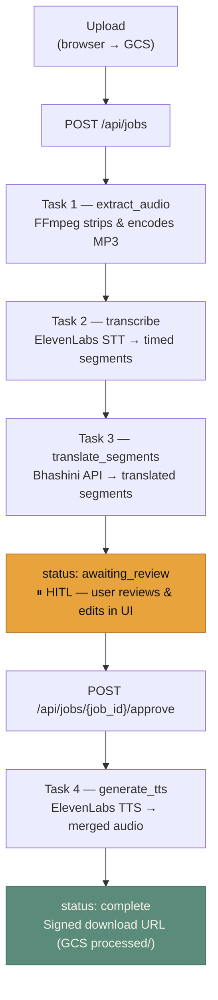

<div align="center">

  <h1>Localizer AI</h1>

  <p>
    An audio localization pipeline for Indic languages — upload a video or audio file, review the generated translation, and download a ready-to-use localized audio track.
  </p>

  <p>
    <a href="https://fastapi.tiangolo.com/">
      
    </a>
    <a href="https://www.python.org/">
      
    </a>
    <a href="https://react.dev/">
      
    </a>
    <a href="https://cloud.google.com/storage">
      
    </a>
    <a href="https://clerk.com/">
      
    </a>
  </p>

</div>

<hr />

## Table of Contents
**1. [Technical Architecture](#1-technical-architecture)<br>
2. [Installation and Deployment](#2-installation-and-deployment)<br>
3. [Access & Credentials](#3-access--credentials)<br>
4. [Data Flow Info](#4-data-flow-info)<br>
5. [Roadmap & Future Work](#5-roadmap--future-work)<br>**

---
#### Note: This is currently audio-only migrated version of Frappe app. For more info, check <u>[Frappe Video Localization ↗](https://github.com/theapprenticeproject/Video_Translation)</u>.

## 1. Technical Architecture

### 1.1 System Architecture

#### 1.1.1 Pipeline Flow

The pipeline processes one job sequentially through four automated stages with a single HITL pause point:

* **Stage 1 — Audio Extraction**<br>
  The uploaded file (video or audio) is downloaded from GCS. FFmpeg strips the audio track and re-encodes it as an MP3. The extracted audio is uploaded back to GCS under `originals/`.

* **Stage 2 — Transcription**<br>
  The MP3 is sent to ElevenLabs Speech-to-Text (STT). The response is a list of timed text segments: `[{ index, original, start, end }, ...]`. These segments are stored in the job's metadata in Redis.

* **Stage 3 — Translation + HITL Pause**<br>
  Each segment is sent to the Bhashini API for translation into the target language. Translated segments are written back to job metadata. The pipeline then sets `status: awaiting_review` and halts — waiting for the user to review and optionally edit the translations in the UI.

* **Stage 4 — TTS Synthesis**<br>
  After the user approves (via `POST /api/jobs/{job_id}/approve`), ElevenLabs Text-to-Speech synthesizes all approved segments using the chosen voice. The final merged audio is uploaded to GCS under `processed/` and the job is marked `complete`. A signed download URL is then available via `GET /api/jobs/{job_id}/download`.


```mermaid
flowchart TD
    A["Upload\n(browser → GCS)"] --> B["POST /api/jobs"]
    B --> T1["Task 1 — extract_audio\nFFmpeg strips & encodes MP3"]
    T1 --> T2["Task 2 — transcribe\nElevenLabs STT → timed segments"]
    T2 --> T3["Task 3 — translate_segments\nBhashini API → translated segments"]
    T3 --> HITL["status: awaiting_review\n⏸ HITL — user reviews & edits in UI"]
    HITL --> AP["POST /api/jobs/{job_id}/approve"]
    AP --> T4["Task 4 — generate_tts\nElevenLabs TTS → merged audio"]
    T4 --> DONE["status: complete\nSigned download URL (GCS processed/)"]

    style HITL fill:#E8A33D,color:#0E1210,stroke:#B5722A
    style DONE fill:#5B8C7B,color:#F3EFE6,stroke:#3F7A63
```

#### 1.1.2 Queue Processing

Background tasks are managed by **Python RQ** (Redis Queue):

* A single `default` queue is shared by all pipeline tasks.
* Each task reads its inputs from `job.meta` (stored in Redis), performs its work, writes results back to `job.meta` via `job.save_meta()`, and then enqueues the next task.
* The `worker` container runs `uv run python -m app.worker`, consuming jobs from the queue indefinitely.
* On failure, each task catches the exception, sets `job.meta["status"] = "failed"` with an error message, and halts the chain. The frontend polls this and surfaces the error state.
* Job timeout budgets: audio extraction 5 min, transcription + translation 10 min, TTS 25 min.

### 1.2 Tech Stack

| Layer | Technology |
|---|---|
| **Backend framework** | FastAPI 0.115+ (Python 3.12) |
| **Package manager** | `uv` & `pnpm` |
| **Task queue** | Python RQ 1.16+ backed by Redis |
| **File storage** | Google Cloud Storage (GCS) — signed URL uploads & downloads |
| **Frontend** | React 19 + Vite 8 + TypeScript |
| **Authentication** | Clerk (`clerk-backend-api` SDK, networkless PEM JWT verification) |
| **Reverse proxy** | Nginx (production only) |
| **Containerization** | Docker Compose |
| **STT** | ElevenLabs Speech-to-Text |
| **TTS** | ElevenLabs Text-to-Speech |
| **Translation** | Bhashini (`dhruva-api.bhashini.gov.in`) |
| **Audio processing** | FFmpeg (via `subprocess` in `audio.py`) |

### 1.3 Project Structure

```
localizer-ai/
├── backend/
│   ├── app/
│   │   ├── main.py           # FastAPI entry point, CORS, router registration
│   │   ├── config.py         # pydantic-settings, reads all env vars from .env
│   │   ├── auth.py           # Clerk JWT verification dependency (require_auth)
│   │   ├── logger.py         # Structured logging helper
│   │   ├── worker.py         # RQ worker entrypoint
│   │   ├── routes/
│   │   │   ├── upload.py     # POST /api/upload/signed-url
│   │   │   └── jobs.py       # POST/GET/PATCH/POST /api/jobs/*
│   │   ├── tasks/
│   │   │   ├── audio.py      # FFmpeg audio extraction (Task 1)
│   │   │   ├── transcribe.py # ElevenLabs STT (Task 2)
│   │   │   ├── translate.py  # Bhashini translation (Task 3)
│   │   │   └── tts.py        # ElevenLabs TTS synthesis (Task 4)
│   │   └── services/
│   │       ├── gcs.py        # GCS service account wrapper
│   │       ├── elevenlabs.py # ElevenLabs STT + TTS wrappers
│   │       └── bhashini.py   # Bhashini translation API wrapper
│   ├── Dockerfile
│   └── pyproject.toml
├── client/                   # React 19 + Vite frontend
│   ├── src/
│   │   ├── App.tsx           # Root component, Clerk auth gate, step router
│   │   ├── main.tsx          # ClerkProvider root
│   │   ├── index.css         # Design system (CSS custom properties, tape-deck palette)
│   │   ├── api/              # Typed fetch wrappers (client.ts)
│   │   ├── components/       # Shared UI components (tape strip, etc.)
│   │   └── steps/            # Upload, Configure, Progress, Review, Download
│   ├── Dockerfile            # Multi-stage: dev (Vite HMR) + prod (Nginx static)
│   └── package.json
├── nginx/
│   └── prod.conf             # Serves React dist, proxies /api to backend:8000
├── compose.yaml              # Dev stack: redis + backend + worker + frontend
├── compose.production.yaml   # Production overlay: no dev ports, Nginx ingress, SSL
└── .env.example              # Template with all required keys
```

### 1.4 Hosting Environment and Deployment Setup

* **Dev:** 
  ```bash 
    docker compose up --build
  ``` 
  Four containers (`redis`, `backend`, `worker`, `frontend`). Frontend runs Vite dev server on port `5173` with HMR. Backend on port `8000`.
* **Production:** 
  ```bash 
    docker compose -f compose.yaml -f compose.production.yaml up --build -d
  ```
  The production override removes exposed ports from `redis`/`backend`, excludes the Vite dev container, and brings up an `nginx` container that:
  * Serves the pre-built React static bundle from `client/Dockerfile` (`target: prod` multi-stage build).
  * Reverse-proxies all `/api` requests to `backend:8000` internally.
  * Terminates SSL via Let's Encrypt certificates mounted from the host at `/etc/letsencrypt`.

### 1.5 API Reference

All endpoints (except `/health`) require a valid Clerk session token in the `Authorization: Bearer <token>` header.

| Method | Endpoint | Description |
|--------|----------|-------------|
| `GET` | `/health` | Health check — returns `{ "status": "ok" }`. No auth required. |
| `POST` | `/api/upload/signed-url` | Body: `{ filename, content_type }` — Returns `{ upload_url, object_name }`. Client PUTs file directly to `upload_url` (GCS signed URL). |
| `POST` | `/api/jobs` | Body: `{ object_name, language, voice_id }` — Returns `{ job_id }`. Enqueues Task 1. |
| `GET` | `/api/jobs/{job_id}` | Returns full job metadata: `{ status, stage, error, segments, ... }`. Frontend polls every 3s. |
| `PATCH` | `/api/jobs/{job_id}/segments` | Body: `{ segments: [{ index, original, translated }] }`. Saves user edits. Only valid when `status: awaiting_review`. |
| `POST` | `/api/jobs/{job_id}/approve` | Enqueues Task 4 (TTS). Only valid when `status: awaiting_review`. |
| `GET` | `/api/jobs/{job_id}/download` | Returns `{ download_url }` — a signed GCS URL for the processed audio. Only valid when `status: complete`. |

### 1.6 Third-Party Integrations and Dependencies

| Dependency | Purpose |
|---|---|
| **ElevenLabs** | Speech-to-Text (STT) transcription + Text-to-Speech (TTS) synthesis |
| **Bhashini (Dhruva API)** | Neural machine translation for Indic languages |
| **Google Cloud Storage** | Object storage for original uploads and processed audio |
| **Clerk** | User authentication and JWT session management |
| **FFmpeg** | Audio extraction from video files (runs inside backend Docker image) |
| **Redis** | RQ broker and job state store |

---

## 2. Installation and Deployment

### 2.1 Prerequisites

* Docker + Docker Compose v2+
* A [Google Cloud Platform](https://console.cloud.google.com/) project with:
  * Cloud Storage API enabled
  * A GCS bucket created with prefixes `originals/` and `processed/`
  * A Service Account with `Storage Object Admin` on the bucket, and its JSON key downloaded
* An [ElevenLabs](https://elevenlabs.io/) account and API key
* A [Bhashini / ULCA](https://bhashini.gov.in/) account and API key. Reference: [Bhashini APIs](https://dibd-bhashini.gitbook.io/bhashini-apis)
* A [Clerk](https://clerk.com/) application with a published frontend (for `VITE_CLERK_PUBLISHABLE_KEY`) and backend secret key

---

### 2.2 Environment Configuration

Copy `.env.example` to `.env` and fill in all values:

```env
# Google Cloud Storage
# Paste the entire JSON content of your service account key file here
GCS_SERVICE_ACCOUNT_JSON={"type":"service_account",...}
GCS_BUCKET_NAME=your-bucket-name
GCS_BUCKET_PREFIX=your-prefix

# AI Providers
ELEVENLABS_API_KEY=sk_...
BHASHINI_API_KEY=...

# Redis (internal Docker network)
REDIS_URL=redis://redis:6379

# App — set to your frontend origin (for CORS + Clerk authorized_parties)
CLIENT_CORS_ORIGIN_URL=http://localhost:5173

# Clerk — Backend
CLERK_SECRET_KEY=sk_...
CLERK_JWKS_PUBLIC_KEY="-----BEGIN PUBLIC KEY-----\n...\n-----END PUBLIC KEY-----"

# Frontend (Vite)
VITE_API_SERVER_URL=http://localhost:8000
VITE_CLERK_PUBLISHABLE_KEY=pk_...
```

> **Note on `GCS_SERVICE_ACCOUNT_JSON`:** The value is the raw JSON content of your service account key file (not a file path). Paste the full JSON object as a single-line string.

> **Note on `CLERK_JWKS_PUBLIC_KEY`:** Obtain this from your Clerk Dashboard under **API Keys** > **JWT public key** (PEM format). Used for networkless token verification — no per-request call to Clerk's servers.

---

### 2.3 Local Development

```bash
# 1. Clone the repository
git clone https://github.com/theapprenticeproject/Video_Translation.git
cd localizer-ai

# 2. Copy and fill in environment variables
cp .env.example .env
# Edit .env with your keys

# 3. Start all services (redis, backend, worker, frontend)
docker compose up --build
```

Services started:

| Container | Port | Purpose |
|---|---|---|
| `redis` | — (internal) | RQ broker + job state |
| `backend` | `8000` | FastAPI REST API |
| `worker` | — (internal) | RQ background task worker |
| `frontend` | `5173` | Vite dev server (HMR enabled) |

The frontend will be available at **http://localhost:5173**. The backend API at **http://localhost:8000**. Health check: `GET http://localhost:8000/health`.

To scale the worker (process more jobs concurrently):
```bash
docker compose up --scale worker=2
```

---

### 2.4 Production Deployment

Production uses a Compose override file. The key differences from dev:
* `backend` and `redis` ports are **not** exposed to the host.
* The Vite dev container is **excluded** (via `profiles: [dev-only]`).
* An `nginx` container is brought up — it builds the React app into a static bundle (multi-stage Dockerfile `target: prod`) and serves it on ports `80`/`443`.
* SSL is terminated by Nginx using Let's Encrypt certificates mounted from the host.

```bash
# Ensure /etc/letsencrypt exists on the host with valid certs (e.g. via Certbot)
# Then deploy:
docker compose -f compose.yaml -f compose.production.yaml up --build -d
```

The Nginx config at `nginx/prod.conf` handles:
* Serving the React static bundle for all non-API routes.
* Proxying `/api/*` requests to `backend:8000` on the internal Docker network.
* SSL termination (HTTPS to HTTP internally).

For `CLIENT_CORS_ORIGIN_URL` and `VITE_API_SERVER_URL` in production:
* Set `CLIENT_CORS_ORIGIN_URL` to your production domain (e.g. `https://localizer.example.com`).
* Set `VITE_API_SERVER_URL` to `""` (empty string) — Nginx proxies `/api` internally, so the frontend uses relative URLs.

---

## 3. Access & Credentials

### 3.1 Application Access
* Users must sign up / log in via **Clerk** before accessing the pipeline. Authentication is enforced on all `/api/jobs/*` and `/api/upload/*` endpoints.
* The frontend presents a sign-in gate (blur overlay) when no active Clerk session is detected. Sign-in and sign-up are handled via Clerk modals — no separate auth pages.

### 3.2 Required Credentials Summary

| Credential | Where to Obtain | Where Used |
|---|---|---|
| GCS Service Account JSON | GCP Console > IAM > Service Accounts > Keys | `GCS_SERVICE_ACCOUNT_JSON` in `.env` |
| ElevenLabs API Key | [ElevenLabs Dashboard](https://elevenlabs.io/app/api) | `ELEVENLABS_API_KEY` in `.env` |
| Bhashini API Key | [ULCA Developer Portal](https://bhashini.gov.in/ulca/user/register) | `BHASHINI_API_KEY` in `.env` |
| Clerk Secret Key | Clerk Dashboard > API Keys | `CLERK_SECRET_KEY` in `.env` |
| Clerk JWKS Public Key (PEM) | Clerk Dashboard > API Keys > JWT public key | `CLERK_JWKS_PUBLIC_KEY` in `.env` |
| Clerk Publishable Key | Clerk Dashboard > API Keys | `VITE_CLERK_PUBLISHABLE_KEY` in `.env` |
| ElevenLabs Voice ID | [ElevenLabs Voice Library](https://elevenlabs.io/voice-library) | Supplied at job creation in the UI |

### 3.3 GCS Bucket Setup (One-Time Manual)
1. Create a GCP project and enable the **Cloud Storage API**.
2. Create a bucket (e.g. `localizer-ai-prod`). Two logical prefixes are used by the pipeline:
   - `originals/` — uploaded source files and extracted audio
   - `processed/` — final synthesized audio output
3. Create a **Service Account**, assign it `Storage Object Admin` on the bucket.
4. Download the JSON key and paste its content into `GCS_SERVICE_ACCOUNT_JSON`.

---

## 4. Data Flow Info

### 4.1 Job Lifecycle and Status Values

A job progresses through the following `status` and `stage` values, stored in Redis via `job.meta`:

```json
{
  "status": "processing | awaiting_review | complete | failed",
  "stage":  "extracting | transcribing | translating | awaiting_review | generating_tts | done",
  "error":  null,
  "gcs_original":  "originals/<uuid>_<filename>",
  "gcs_audio":     "originals/<job_id>.mp3",
  "gcs_processed": "processed/<job_id>_translated.mp3",
  "language":  "hi | mr | pa",
  "voice_id":  "<elevenlabs_voice_id>",
  "segments":  [{ "index": 0, "original": "...", "translated": "..." }]
}
```

| Status | Meaning |
|---|---|
| `processing` | A background task is actively running |
| `awaiting_review` | Translation complete — waiting for user HITL approval |
| `complete` | TTS done — processed audio available for download |
| `failed` | A task encountered an unrecoverable error — see `error` field |

### 4.2 File Storage Paths (GCS)

| Path | Contents |
|---|---|
| `originals/<uuid>_<filename>` | Original uploaded file (video or audio) |
| `originals/<job_id>.mp3` | Extracted audio track (post FFmpeg) |
| `processed/<job_id>_translated.mp3` | Final localized audio (post TTS) |

All files are accessed via **signed URLs** (v4, 15-minute expiry for uploads; 60-minute expiry for downloads). No GCS file is ever publicly accessible.

### 4.3 Supported Languages

| Language | Code|
|---|---|
| Hindi | `hi` |
| Marathi | `mr` |
| Punjabi | `pa` |
| Kannada | `ka` |

Currently, the Translation source language is fixed as **Hindi** (`hi`), also the Bhashini service ID is fixed as `ai4bharat/indictrans-v2-all-gpu--t4`.

---

## 5. Possible Future Add-ons

| Feature | Notes |
|---|---|
| **History & gallery** | Stage 6 (optional) — Database for per-user job history and audio gallery view. |
| **Multiple speaker support** | Segment TTS by detected speaker, apply per-speaker voice IDs. |
| **Automatic Voice ID Support** | Saving previously used ElevenLabs Voice IDs, or populate a dropdown selection menu in job creation UI. |
| **Advanced Voice Controls** | Fine-grained TTS customization (voice expressions, speech speed adjustments, and multi-voice scripts). |