# Video Localizer - Translator
***An automated video localizer/translator for native Indian languages.***

## 📋 Table of Contents 
- [Installation](#-installation)
- [Dependencies](#-dependencies)
    - [`uv` - Python Package Manager](#python-depedency-management--using-uv-)
    - [Tools/Libraries](#core-toolslibraries)
- [Configuration](#️-configuration)
- [Authentication](#-authentication)
- [System Architecture](#️-system-architecture)
    - [Doctype Design](#-doctype-design)
    - [Doctype Dataflow & Processing](#-doctype-dataflow--processing--ux-)
    - [API Flows](#-current-api-flows)
    - [Sequence Diagram](#-sequence-diagram)
- [Contributing](#-contributing)
- [License](#-license)

---

## 📦 Installation
### Bench Installation
You can install this app using the [bench](https://github.com/frappe/bench) CLI:

```bash
cd $PATH_TO_YOUR_BENCH
bench get-app git@github.com:theapprenticeproject/Video_Translation.git --branch main
bench install-app my_app
```

### Video Preview app ( Optional )
This frappe app provides a better preview for video uploads upon saving a record for a doctype, improving user experience.
```
bench get-app git@github.com:Z4nzu/frappe-preview-attachment.git
bench --site your-site-name install-app preview_attachment
```
Reference : [Frappe-Video-Preview-github ↗](https://github.com/Z4nzu/frappe-preview-attachment) 

## 🧰 Dependencies
### ⚡ Python Depedency Management ( using `uv` )
Install `uv` : ( official site : [`uv` Installation Reference ↗](https://docs.astral.sh/uv/getting-started/installation/) )
```
curl -LsSf https://astral.sh/uv/install.sh | sh
```
Install Dependencies: 
```
uv pip install -r pyproject.toml
```
### 🛠️ Core Tools/Libraries
* **FFMPEG :**
    * Used for audio/video processing ( e.g., extracting audio from uploaded video ).
    * Installation Reference: [FFMPEG Official Docs ↗](https://ffmpeg.org/download.html)
* **Bhashini :**
    * GOI's language translation platform for Indian languages ( STS, ASR, Language Detection, etc. ).
    * Required credentials are `userId`, `ulcaApiKey`, `email id`.  
    * Setup Guide: [Bhashini Postman Docs ↗](https://dibd-bhashini.gitbook.io/bhashini-apis/)
* **Groq :**
    * Provides fast speech-to-text (STT), text-to-speech (TTS), and other capabilities.
    * Docs: [Groq API Reference↗](https://console.groq.com/docs/overview)
* **Elevenlabs :**
    * Provides high-quality voice dubbing, multilingual TTS & other services.
    * Docs: [ElevenLabs API ↗](https://elevenlabs.io/docs) 


## ⚙️ Configuration
* We utilise Frappe `site_config.json` for settings & environment variables ( local dev setup ).
    ```json
    {
    "db_name": "[Your_DB_Name]",
    "db_password": "[Your_DB_Password]",
    "db_type": "mariadb",
    "db_user": "[Your_DB_User]",
    "max_file_size": "[filesize_in_bytes]",
    "encryption_key": "[Encrption_Key]",
    "api_auth_value": "[Bhashini API Authentication value]",
    "groq_api_key":"[GROQ_API_KEY]",
    "elevenlabs_api_key":"[ELEVENLABS_API_KEY]",
    "sieve_api_key":"[SIEVE_API_KEY]"
    }
    ```
    Values can be accessed by `frappe.conf.[variable_key_name]`.

* The pipeline uses Frappe background job queue for concurrent processing. By default workers are defined in `common_site_config.json`. If the workload increases (e.g., handling multiple video translations simultaneously), you can scale by increasing the no.of workers in this configuration and thus increased parallelism.
    ```json    
    {
    "background_workers": "[number_of_workers]",
    "default_site": "[your_site_name]",
    "developer_mode": true,
    "file_watcher_port": 6787,
    "frappe_user": "[your_user_name]",
    "gunicorn_workers": "[2 x CPU_Cores + 1]",
    "live_reload": true,
    "rebase_on_pull": false,
    "redis_cache": "redis://127.0.0.1:13000",
    "redis_queue": "redis://127.0.0.1:11000",
    "redis_socketio": "redis://127.0.0.1:13000",
    "restart_supervisor_on_update": false,
    "restart_systemd_on_update": false,
    "serve_default_site": true,
    "shallow_clone": true,
    "socketio_port": 9000,
    "use_redis_auth": false,
    "webserver_port": 8000
    }
    ```
    Tasks such as language detection and dubbing are offloaded to workers, preventing long-running operations from blocking main requests.
* During setup, some of the values are set automatically.

## 🔐 Authentication
All API requests require authentication header using a token in the format:
```ruby
token <api_key>:<api_secret>
```
This must be included in the request headers to ensure only authorized clients can access pipeline entry points. These tokens can be stored securely in `site_config.json`.

## 🏗️ System Architecture

### 📐 Doctype Design
The database schema contains this application's Doctypes: Video Info, Processed Video Info, & Educator Profile. The diagram below highlights the definitions and relationships for the doctypes afformentioned. 

---

### 🗃️ Doctype Dataflow & Processing ( UX )
The diagram illustrates dataflow for a video localization system that utilises background queues to handle a series of sequential functions/tasks. An overview of the steps are highlighted below:
1. A user uploads a video with the details, which creates a **Video Info** record. This uploaded video is saved into the local filesystem under `public/` directory of `original/` (created manually).
2. Once user initiates the process (by clicking "Start Process" button), a chain of background jobs begin. These jobs are managed by **Frappe Queues** system which allows multiple videos to be processed concurrently. Multiple queues are used each dedicated to a specific function:
    * Audio extraction function processes original video file and extracts audio file, thus placing this audio file into another queue for next step.
    * Language detection function processes audio output from previous step (audio extraction function) and detects spoken language. 
    * Subsequent API functions are called and executed in respective queues like subtitle generation, dubbing, etc.
This queuing system ensures each function is executed only after preceding function is completed.
3. As each function in queue completes, it creates and updates a record in **Processed Video Info** doctype. This new record is updated with status with the queuing process allowing us to micro-manage it. The processed Video files along with translated audio files (if any) are stored under `public/` directory of `processed/` (created beforehand).


---

### 🌐 Current API Flows
The diagram showcases API flow which are versioned as v1 and v2 and details it as respectively below:  
* **v1 - Non-Hindi Translations :** This flow is designed for multi-step translations often Indic languages other than hindi. Its a pipeline of API calls and local processing stages.
    * Detecting Source language is the common step among both API version which begins with Bhashini language detection API. Audio Extracted using FFMPEG & the output audio file is passed onto next step.
    * Bhashini Speech to Speech (STS) API is a core pipelined translation service which takes audio file and ouputting a new Translated audio file.
    * Muxing of the translated audio is done by overwriting(using FFMPEG) the original audio thus creating a new Translated video file with translated audio track.
    * The final step is populating the generated subtitle file with the newly created translated video file by via the HTML field `video_preview`.

* **v2 - Hindi Translations :** This flow involves specialized processes for translating to Hindi for a better integrated dubbing experience and can be represented as:
    * **Path I (ElevenLabs)**:
        * The workflow takes the detected language(optional) along with video file and uses the ElevenLabs Dubbing API which handles dubbing. The API outputs a Dubbed Video thus avoiding muxing multiple times.
    * **Path II (Sievedata) :** (option)
        * This represents highly configurable, alternative service. This is intended for more requirements as it can also handle lip sync such services in addition to direct dubbing.

* **Common Processes**
    * When subtitles are needed (end of Video Processing Pipeline), FFMPEG is used to extract the audio track from the original video. This extracted audio is passed to a Speech-to-Text (STT) Groq service and a subtitle file (SRT/VTT) is created.


---

### 🔁 Sequence Diagram
This diagram illustrates the end-to-end flow of video localization pipeline. It covers two translation paths and  how different components — video upload, audio extraction (ffmpeg), speech-to-text (Groq), translation, STS (Bhashini), text-to-speech (Elevenlabs) and final video assembly interact and flow step by step together. The goal is to provide clear view of request/response patterns across modules, making it easier to understand how the system orchestrates localization.

```mermaid
sequenceDiagram
  autonumber

  participant UserVideo
  participant BhashiniAPI as Bhashini API
  participant FFMPEG
  participant STSAPI as Bhashini STS API
  participant GroqSTT as Groq STT API
  participant ElevenLabs as ElevenLabs Dubbing API
  participant SieveData
  participant Output as Final Output

  %% V1 - Non-Hindi Translations
  UserVideo->>BhashiniAPI: Detect source language
  UserVideo->>FFMPEG: Extract audio (wav)
  FFMPEG->>STSAPI: Send audio for translation
  STSAPI->>GroqSTT: Translated audio → transcription
  GroqSTT->>Output: Generate SRT/VTT subtitle file
  STSAPI->>FFMPEG: Return translated audio
  FFMPEG->>Output: Mux translated audio with video
  Output->>Output: Populate VTT file with video (final subtitles)

  Note over UserVideo,Output: V1 - Non-Hindi Translation Flow

  %% V2 - Hindi Direct Translation
  UserVideo->>ElevenLabs: Send video for dubbing (Option I)
  ElevenLabs->>GroqSTT: Transcription from dubbed video
  GroqSTT->>Output: Generate VTT subtitle file

  UserVideo->>SieveData: Send video for dubbing + lip sync (Option II)

  Note over ElevenLabs,SieveData: V2 - Hindi Direct Translation Options
```

## 🤝 Contributing

Follow Installation steps above to run locally.

`pre-commit` is for code formatting and linting. Please [install pre-commit](https://pre-commit.com/#installation) and enable it for this repository:

```bash
cd apps/my_app
pre-commit install
```

Pre-commit is configured to use the following tools for checking and formatting your code:

- ruff
- eslint
- prettier
- pyupgrade

## 📜 License

The project is licensed under the MIT License. See the LICENSE file ( `license.txt` ) for details.
